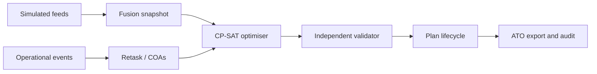

# VYUHA — Dynamic Air Operations & Resource Optimisation

**SIH26250 · Smart India Hackathon 2026 · Theme: Transportation & Logistics**

> *The sky changes. Your plan keeps up.*

VYUHA is a **synthetic, fictional** decision-support prototype. It fuses eight simulated feeds, builds an air tasking order with Google OR-Tools CP-SAT, and offers ranked courses of action when the day changes. A person approves. An independent validator re-checks the plan.

**SYNTHETIC DATA | UNCLASSIFIED PROTOTYPE | NOT FOR OPERATIONAL USE**

## FUSE → PLAN → RETASK → DECIDE

| Verb | What is in the app |
|------|--------------------|
| **Fuse** | `/app/fusion` — feed LEDs, degrade/restore, conflict inbox |
| **Plan** | `/app/plan` — Optimise, Validate, Gantt |
| **Retask** | `/app/retask` — Inject disruption, COA cards, server-side rank |
| **Decide** | `/app/ato` — Submit, Approve, Co-sign, Publish, PDF |



## Quick start

```bash
pnpm install
uv sync --directory services/api
pnpm seed          # MERIDIAN · S1 · seed 26250 · scale M
pnpm dev           # web :3000 and API :8000
```

Open [http://localhost:3000](http://localhost:3000) → **Launch live demo**. Demo cards appear when `DEMO_MODE=true`.

**Judge tour:** sign in, open `/app/judge`, press **RESET DEMO** (loads pack S5, seed 26250, scale M), then follow the step links. Script: `docs/DEMO_SCRIPT.md`.

Docker Compose (`infra/docker-compose.yml`) starts Postgres 16, the API, the web app, and Caddy on port 8080. The API container still defaults to SQLite on `/data/vyuha.db` unless `DATABASE_URL` is overridden. See `docs/adr/0001-sqlite-prototype.md`.

## Demo roles

| Role | Email | Use in the demo |
|------|--------|-----------------|
| Ops Planner | planner@vyuha.local | Optimise, inject events, submit |
| Commander | commander@vyuha.local | Approve, publish, acknowledge |
| Auditor | auditor@vyuha.local | Co-sign, verify the audit chain |
| Fleet Officer | fleet@vyuha.local | Aircraft and stores; threats register is masked |
| Crew Officer | crew@vyuha.local | Crew; threats register is masked |
| Situation Analyst | analyst@vyuha.local | Intel events |
| Admin | admin@vyuha.local | Load a scenario pack |

Default demo password: `Vyuha-demo-2026` (see `.env.example`). Demo cards call `POST /api/v1/auth/demo` with the role id. Emails above are the seeded login ids.

## What is actually on screen

| Area | Route | Present |
|------|--------|---------|
| Landing | `/` | Disclaimer, mini board, how-it-works, benchmark sentence |
| Auth | `/login` | Password login; demo role cards when demo mode is on |
| Dashboard | `/app` | Command glance |
| Planner | `/app/plan` | Optimise, Validate, Gantt |
| Retask | `/app/retask` | Inject disruption, COAs |
| Missions | `/app/missions`, `/app/missions/[id]` | List and detail, including why-not |
| Registers | `/app/fleet`, `/app/crew`, `/app/stores`, `/app/bases` | Seeded registers |
| COP | `/app/fusion`, `/app/map` | Feed health; map of bases |
| ATO | `/app/ato` | Lifecycle and PDF |
| Audit | `/app/audit` | List and **Verify integrity** |
| Forecasts | `/app/analytics` | Serviceability card, risk, Monte Carlo |
| Judge / Admin | `/app/judge`, `/app/admin` | Step tour; scenario load |

Routes the spec names and this tree does not have: `/app/simulate`, `/app/handover`, `/app/settings`.

## Stack

- **Web:** Next.js (App Router), TypeScript, Tailwind
- **API:** FastAPI, SQLAlchemy 2, Pydantic v2, SQLite via `create_all` (Alembic skeleton only)
- **Optimiser:** OR-Tools CP-SAT, greedy fallback, separate validator
- **Trust:** argon2id, httpOnly cookies, CSRF, RBAC, hash-chained audit

## Tests

```bash
pnpm test          # Vitest and pytest
pnpm lint
pnpm typecheck
pnpm benchmark     # writes docs/benchmarks/latest.json (simulated, scale S)
```

## Honest limitations

- Not accredited. Theatre MERIDIAN, tails, and load-out classes LC-A–LC-I are generated fiction. No weapon effects.
- The checked-in benchmark is two scale-S seeds. Do not quote a percentage that is not in `docs/benchmarks/latest.json`.
- “Why not” is a heuristic, not a solver unsat core.
- The serviceability model does not drive the optimiser.
- Full gap list: `docs/agent-quality.md`.

Spec: `docs/SPEC.md`. Architecture: `docs/ARCHITECTURE.md`.
