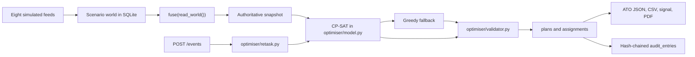

# VYUHA architecture (prototype)

## What each process does

| Path | Role |
|------|------|
| `apps/web` | Next.js UI. Browser calls same-origin `/api/v1`. |
| `services/api/app` | FastAPI, auth, RBAC, SQLite, audit, ATO export |
| `services/api/scenarios` | Deterministic MERIDIAN generator, packs S1–S5, `pnpm seed` |
| `services/api/fusion` | `fuse()` plus degrade policies and a seeded conflict inbox |
| `services/api/optimiser` | CP-SAT, greedy, validator, explain, retask |
| `services/api/analytics` | Heuristic risk, logistic serviceability card, small Monte Carlo, benchmark script, regex assistant |
| `docs/benchmarks` | JSON written by `pnpm benchmark` and the serviceability trainer |
| `infra/docker-compose.yml` | Postgres 16, API, web, Caddy. API still defaults to SQLite. |

There is no WebSocket channel. Optimise, validate, and COA generation run inside the HTTP request.

## Invariants that the code enforces

1. **One snapshot.** `fusion/snapshot.py` `fuse()` is what the planner, validator, retask, and command glance read.
2. **Scenario load replaces the world.** `write_world(..., reset_operational=True)` on scenario load/reset. Injected events update the fused picture and do not by themselves delete plan rows.
3. **Validator last word.** Publish calls `validate()` and rejects a plan the validator fails. The UI copy should follow that report; this document does not claim every screen does.
4. **Human on the loop.** `POST /coas/{id}/select` stores a **DRAFT**. Publish requires status `APPROVED`, a `co_approved_by` user, a matching SHA-256 digest, and a valid report.

## Feeds

IDs in `scenarios/catalog.py`: MSS, CRFR, ASL, AMF, MET, TIP, TAP, EXF. Degrade handling that changes the snapshot is implemented for MSS (FMC treated as PMC), MET (weather marked stale), TIP (radius × 1.25), and CRFR (hours bumped). ASL, AMF, TAP, and EXF are present as source rows.

## Scenario packs

| Pack | Effect in `scenarios/generate.py` |
|------|-----------------------------------|
| S1 | Baseline day, no extra mutation |
| S2 | BASE-BRAVO closed about epoch+8h to +12h, low ceiling |
| S3 | Pop-up SAR `MSN-901` and airlift `MSN-902` |
| S4 | Three tails NMC and early pilots unavailable |
| S5 | Extra threat `TZ-7` and shifted tanker tracks |

Default seed command: pack S1, seed 26250, scale M. Judge reset loads S5 / 26250 / M.

## Clock

`sim_state` stores pack, seed, scale, epoch, sim time, PAUSED/RUNNING, and rate. `GET/POST /api/v1/clock` is the server clock. Murphy intensity is a column (`murphy`, default `OFF`); a live disruption meter is not a separate service.
